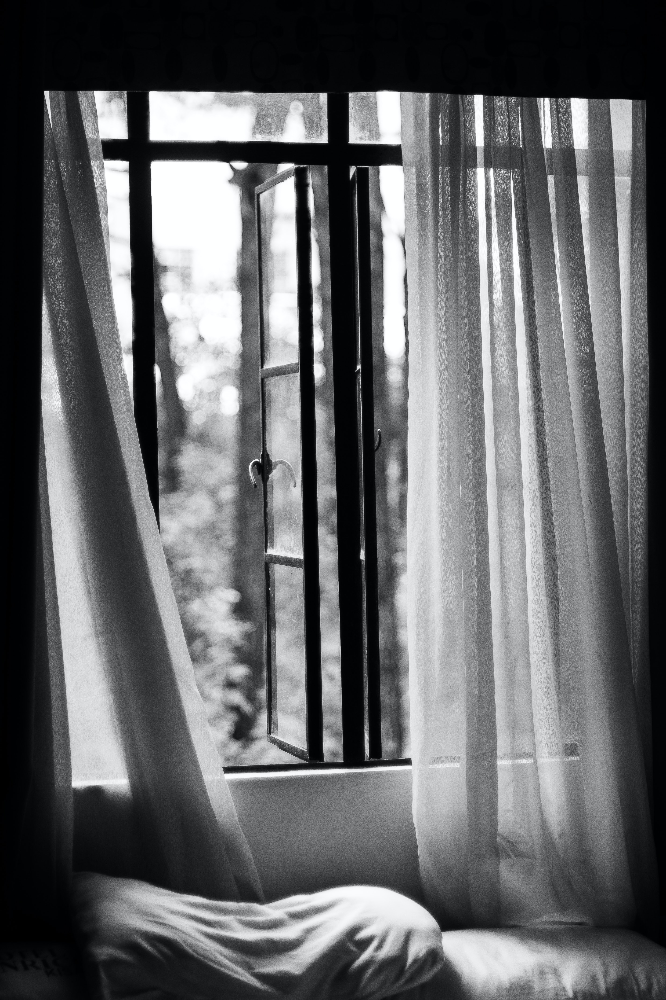

<!-- ## AP CSA Tri 2 Period 2 Table 2

### [Scrum Board](https://github.com/users/PrishaB/projects/1)
### [Insights](https://github.com/PrishaB/Team2Reunion/graphs/contributors)

--- -->

<html>
<head>
<meta name="viewport" content="width=device-width, initial-scale=1">

</head>
<body>

 
 
 
<a class="button" href="/login"> Login </a>
 
<h1>Find A Pad</h1>

 

      
<h2>About Us<h2>
 

    

      

 

<!-- ## Team Members

| Name | GitHub ID and Profile | Roles | Issues |
| --- | --- | --- | --- |
| Linda Liu | [@LindaLiu1202](https://github.com/LindaLiu1202) | Backend Developer |   [Issue](https://github.com/PrishaB/Team2Reunion/issues/4)  | 
| Divyanshi Suri | [@divyanshisuri](https://github.com/divyanshisuri) | Scrum Master |  [Issue](https://github.com/PrishaB/Team2Reunion/issues/2)  |
| Serafina Wong| [@Lychee80 ](https://github.com/Lychee80 ) | DevOps | [Issue](https://github.com/Lychee80/t2_spring_8192/issues/1)  |
| Prisha Boreddy| [@PrishaB ](https://github.com/PrishaB) | Frontend Developer | [Issue](https://github.com/PrishaB/Team2Reunion/issues/2)   | -->
